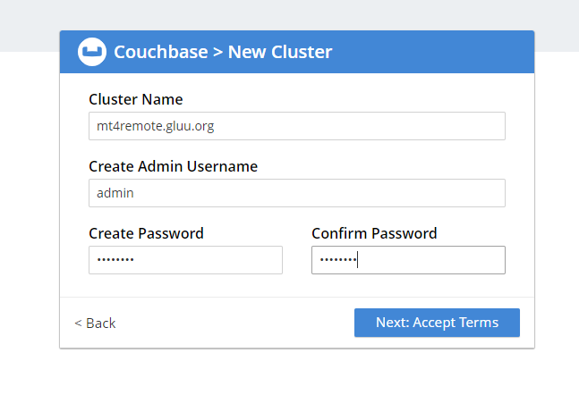
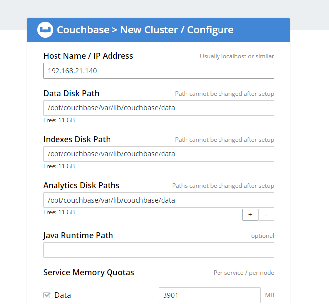
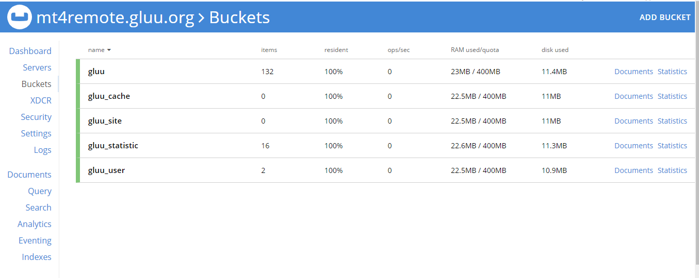

# Gluu Server with Couchbase

## Overview

[Gluu Server 4.0](https://gluu.org/docs/ce/4.0) and onward supports Couchbase Enterprise Edition (EE) as a database backend. Couchbase can be used as an alternative to LDAP, or in addition to LDAP using "hybrid" mode (as documented [below](#hybrid-backend)).  

## Installation

There are two supported deployment strategies: 

- [Local Couchbase installation](#local-installation), where both Gluu and Couchbase are residing on the same servers. This is OK for basic testing. 

- [Remote Couchbase installation](#remote-installation), where Couchbase is on its own dedicated servers. This is recommended for performance testing and production. 

### Local installation

To install a Gluu Server with a local instance of Couchbase: 

 - Prepare a VM with 16GB of RAM, 4 CPU cores, and 40 GB of disk space. 
 - Install the [Gluu Server 4.0](https://gluu.org/docs/ce/4.0/installation-guide/install/) packages, don't run `setup.py` yet. 
 - Start the `gluu-server` service and log in to the Gluu Server chroot
 - Download your preferred [Couchbase package](https://www.couchbase.com/downloads) and save it inside your Gluu Server chroot to `/opt/dist/couchbase`.
 - Run `setup.py` to configure the Gluu Server.
 - When prompted to choose a backend, select Option 2 for Couchbase:
 
    ```
    Install (1) Gluu OpenDj (2) Couchbase (3) Hybrid [1|2|3]
    ```

### Remote installation

To leverage a remote Couchbase cluster, follow these instructions. 

#### Install and configure Couchbase
 
- [Install Couchbase](https://docs.couchbase.com/server/current/install/get-started.html)
- Modify the VM firewalls according to [Couchbase requirements](https://docs.couchbase.com/server/current/install/install-ports.html)
- Configure your Couchbase deployment. Here are couple of screenshots attached from our test setup. 

    

    

#### Install and configure Gluu

- Install [Gluu Server 4.0](https://gluu.org/docs/ce/4.0/installation-guide/install/), but **do not** run `setup.py` yet. 
- After package installation, run these commands: 
   
    ```tab="Ubuntu 18, RHEL 7, Debian 9, or CentOS 7"
    /sbin/gluu-serverd enable

    /sbin/gluu-serverd start
   
    /sbin/gluu-serverd login
   
    cd /install/community-edition-setup/
   
    python setup.py --remote-couchbase
    ```
    
    ```tab="Ubuntu 16"
    service gluu-server start
    
    service gluu-server login
    
    cd /install/community-edition-setup/
    
    ./setup.py --remote-couchbase
    ```
    
- The setup script will add some Couchbase-specific fields to the normal [setup script prompts](https://gluu.org/docs/ce/4.0/installation-guide/setup_py/#setup-prompt):

    - **Couchbase host**: The IP address previously set for Couchbase 
    - **Couchbase Admin user**: The Admin username to log in to Couchbase
    - **Couchbase Admin password**: The password to log in to Couchbase - **this is also set to be the oxTrust admin password**
    - **Use hybrid backends**: If you'd like to leverage a "hybrid" backend with Couchbase *and* OpenDJ, select `yes`
    
### Test

- Test WebUI login
- A successful Couchbase bucket will look like this: 
 
    
 
- Check if all Gluu Server bits are running properly or not ( identity/oxauth/idp/httpd etc. ) 
- Check logs for any error. 

## Hybrid backend

If both Couchbase and OpenDJ are installed (either locally or remote), during setup you can choose Option 3 to support a "hybrid" backend database infrastructure for your Gluu Server:

```
Install (1) Gluu OpenDj (2) Couchbase (3) Hybrid [1|2|3] [1] : 3
  Please note that you have to update your firewall configuration to
  allow connections to the following ports:
  4369, 28091 to 28094, 9100 to 9105, 9998, 9999, 11207, 11209 to 11211,
  11214, 11215, 18091 to 18093, and from 21100 to 21299.
By using this software you agree to the End User License Agreement.
See /opt/couchbase/LICENSE.txt.
Use Gluu OpenDj to store (1) default (2) user (3) cache (4) statistic (5) site : 14
```

Both OpenDJ and Couchbase will be used for storing data. Default data is persisted in OpenDJ, e.g. system configurations, attributes, clients, metrics, etc., while all other data will be stored in Couchbase.

## Data Structure

### Buckets

By default, the following buckets will be created. If using a hybrid backend, buckets that are unused because their data is stored in LDAP will not be created.

#### gluu

This is the default bucket for the Gluu Server, the following documents will be imported to this bucket:
  - Gluu base settings, oxAuth, oxTrust and configurations for other services
  - scopes
  - scripts
  - SCIM/SAML/Passport/RADIUS related documents
  - clients
  - metric (statistic) documents will be inserted to this bucket 

#### gluu_cache

This bucket is used to cache data for easier lookup, rather than searching the database again. The data is accessed with key/value.

This bucket is only used with the NATIVE_PERSISTANCE cache type.

Here is a sample entry:

```
{
  "dat": "rO0ABXNyACZvcmcuZ2x1dS5veGF1dGgubW9kZWwuY29tbW9uLlNlc3Npb25JZPy0UHYpOy4WAgAOTAASYXV0aGVudGljYXRpb25UaW1ldAAQTGphdmEvdXRpbC9EYXRlO0wAAmRudAASTGphdmEvbGFuZy9TdHJpbmc7TAACaWRxAH4AAkwAD2ludm9sdmVkQ2xpZW50c3QAMUxvcmcvZ2x1dS9veGF1dGgvbW9kZWwvY29tbW9uL1Nlc3Npb25JZEFjY2Vzc01hcDtMAAVpc0p3dHQAE0xqYXZhL2xhbmcvQm9vbGVhbjtMAANqd3RxAH4AAkwACmxhc3RVc2VkQXRxAH4AAUwAEXBlcm1pc3Npb25HcmFudGVkcQB+AARMABRwZXJtaXNzaW9uR3JhbnRlZE1hcHEAfgADTAARc2Vzc2lvbkF0dHJpYnV0ZXN0AA9MamF2YS91dGlsL01hcDtMAAxzZXNzaW9uU3RhdGVxAH4AAkwABXN0YXRldAAtTG9yZy9nbHV1L294YXV0aC9tb2RlbC9jb21tb24vU2Vzc2lvbklkU3RhdGU7TAAEdXNlcnQAI0xvcmcvZ2x1dS9veGF1dGgvbW9kZWwvY29tbW9uL1VzZXI7TAAGdXNlckRucQB+AAJ4cHNyAA5qYXZhLnV0aWwuRGF0ZWhqgQFLWXQZAwAAeHB3CAAAAW1Je/50eHQAJDE2OTJhYTQ0LTBkYTctNDQ5Yi05NDA1LTllZDlhZDMyZmFhY3EAfgALcHNyABFqYXZhLmxhbmcuQm9vbGVhbs0gcoDVnPruAgABWgAFdmFsdWV4cABwc3EAfgAJdwgAAAFtSXv+dHhwc3IAL29yZy5nbHV1Lm94YXV0aC5tb2RlbC5jb21tb24uU2Vzc2lvbklkQWNjZXNzTWFwea8dEgakD6MCAAFMABFwZXJtaXNzaW9uR3JhbnRlZHEAfgAFeHBzcgARamF2YS51dGlsLkhhc2hNYXAFB9rBwxZg0QMAAkYACmxvYWRGYWN0b3JJAAl0aHJlc2hvbGR4cD9AAAAAAAAMdwgAAAAQAAAAAXQAKTAwMDgtMzQ1MWU3NjMtZjBiNy00MGQ1LTg5YWYtZjBiZTYyZjZmY2ZlcQB+AA14c3EAfgARP0AAAAAAAAx3CAAAABAAAAAJdAAJYXV0aF9zdGVwdAABMXQAA2FjcnQAFHNpbXBsZV9wYXNzd29yZF9hdXRodAAJcmVtb3RlX2lwdAAPMTA5LjEwNi4xMzQuMTYydAAEb3Bic3QAJGQ1ZTNlN2NiLWJhYjQtNDg2MS1iNTdlLWEyMTcxYWUwZmFiMHQABXNjb3BldAAeb3BlbmlkIHByb2ZpbGUgZW1haWwgdXNlcl9uYW1ldAANcmVzcG9uc2VfdHlwZXQABGNvZGV0AAxyZWRpcmVjdF91cml0AC1odHRwczovL2NiLWRldi5nbHV1Lm9yZy9pZGVudGl0eS9hdXRoY29kZS5odG10AAVub25jZXQABW5vbmNldAAJY2xpZW50X2lkcQB+ABN4dABlYjE1YzcxZWU3MzA3ZDhmYmY5ODliMTEzNTMzNDkwMzgwNGI5MjQ0MDFmNzAxMTBlODMxMTAwMWE3MTdhZmVmZi43OWFhNTZhNS02MWRmLTQxMTItOTIwMy05NzU1YmE2NjNiMzN+cgArb3JnLmdsdXUub3hhdXRoLm1vZGVsLmNvbW1vbi5TZXNzaW9uSWRTdGF0ZQAAAAAAAAAAEgAAeHIADmphdmEubGFuZy5FbnVtAAAAAAAAAAASAAB4cHQAD1VOQVVUSEVOVElDQVRFRHB0AAA=",
  "objectClass": "cache",
  "del": true,
  "dn": "uuid=02cd036773175d7c27dca97f830e43eab158c57bef61ea29600ab15b85213469,ou=cache,o=gluu",
  "exp": "2019-09-19T12:27:25.877",
  "iat": "2019-09-19T12:25:25.877",
  "uuid": "02cd036773175d7c27dca97f830e43eab158c57bef61ea29600ab15b85213469"
}
```

#### gluu_site
If you use Cache Refresh, data from the remote database will be imported to this bucket.

#### gluu_token
This bucket is used to store tokens issued for the RP. The following is an example:

```
{
  "scp": "openid user_name email",
  "nnc": "nonce",
  "ssnId": "6c111547-ec94-4959-ad71-a3c775c70d2d",
  "tknCde": "02c3660e0d017efcd126794579afaec9702f92d3b25a6af15657637fa03af9a5",
  "clnId": "0008-3451e763-f0b7-40d5-89af-f0be62f6fcfe",
  "grtId": "494f4f0c-0adc-4efc-be97-b89432537b8e",
  "authzCode": "f75e88ef270e155eb993aad7d964620f52db49b72e81fa593f0178502d993e7e",
  "objectClass": "token",
  "usrId": "user762783",
  "del": true,
  "dn": "tknCde=02c3660e0d017efcd126794579afaec9702f92d3b25a6af15657637fa03af9a5,ou=tokens,o=gluu",
  "authnTime": "2019-09-19T10:25:48.812",
  "attr": {
    "x5cs256": null
  },
  "exp": "2019-09-19T14:25:50.829",
  "iat": "2019-09-19T10:25:50.829",
  "grtTyp": "authorization_code",
  "tknTyp": "refresh_token"
}
```

#### gluu_user

Users and groups will go to this bucket. By default, the `admin` user and `admin` group are created at setup.

### Indexes

Indexes are created according to this JSON: [index.json](https://github.com/GluuFederation/community-edition-setup/blob/master/static/couchbase/index.json)

`setup.py` creates two types of indexes in buckets:

#### Indexes for attributes

Gluu services use attributes to find the intended documents, so `setup.py` creates indexes for certain attributes. For example, for the **gluu_user** bucket, the following index is created for the **inum** attribute:

```
CREATE INDEX gluu_user_inum ON `gluu_user`(`inum`)
```

The index name is formed by joining the bucket name and attribute name with an underscore. (e.g. `gluu_user_inum`).

#### Static Indexes
For faster retrieval of documents, `setup.py` also creates static indexes if necessary. For example, we have this entry in the **gluu** bucket:

```
 [["oxApplicationType", "oxMetricType", "oxStartDate", "oxEndDate"], "objectClass = \"oxMetric\""]
```

For this entry the following index is created:

```
CREATE INDEX gluu_st_1 ON `gluu`(`oxApplicationType`, `oxMetricType`, `oxStartDate`, `oxEndDate`) WHERE objectClass="oxMetric"
```

The index name is "`<bucket_name>_st_#`" where `#` is a consecutive number.

## SCIM Considerations

Please be aware of the following behaviors that developers should account for when executing SCIM searches with Couchbase as the DB: 
 
- Non-deterministic order of results: When `sortBy` is *not* specified, a query can return a different permutation of valid results each time the search is executed.

- Search filters should *not* contain backslash characters in comparison values: This is a Couchbase issue. N1QL queries with backslashes can lead to unexpected results or even runtime errors. An example is the filter `name.familyName co "\"`. 

- Case sensitivity: In LDAP, searching and sorting is case sensitive by default. In Couchbase, the behavior is case sensitive with the exception of equality/inequality filters like `userName eq "JhonHoney"` or `userType ne "Employee"`. Remember that case only matters for attributes of type string. This applies for both core and custom attributes.

- Operators (`le`, `lt`, `gt`, `ge`, `co`, `ew`, `sw`, `eq`) are *not* applicable for attributes with more than one value. When used, no results will be returned. For example, users with more than one telephone number will not be returned when using `phoneNumbers.value sw "555"`, even if one or more of their phones start with "555".

## License

Couchbase Enterprise Edition, and the corresponding integration with Gluu, is commercially licensed software. To discuss licensing, please [schedule a call with us](https://gluu.org/booking). 
